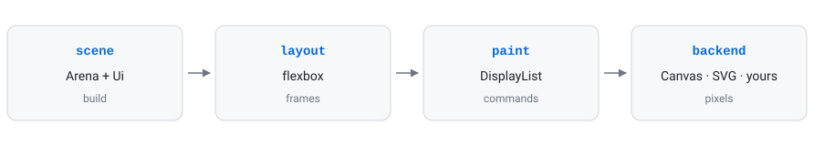

<div align="center">

# gbui

**A UI toolkit for C++20.** Flexbox layout, themeable components, and a painter
interface a backend implements — with no web engine and no dependency beyond the
standard library.

[](https://github.com/gitgusilva/gbui/actions/workflows/ci.yml)

### [gitgusilva.github.io/gbui](https://gitgusilva.github.io/gbui/)

[Guide](https://gitgusilva.github.io/gbui/guide/introduction) ·
[Your first window](https://gitgusilva.github.io/gbui/guide/first-window) ·
[Reference](https://gitgusilva.github.io/gbui/reference/overview) ·
[Contributing](CONTRIBUTING.md)

</div>

---

<p align="center">
  <picture>
    <source media="(prefers-color-scheme: dark)" srcset="docs/public/pipeline-dark.svg">
    
  </picture>
</p>

Each stage reads only the one before it, which is why layout is arithmetic you
can assert without a window and painting is a list of commands you can inspect
without a GPU. Around fifty components sit on top — from a button to a table, a
rich-text editor and eight kinds of chart — all stateless functions, themed by
token rather than by colour.

It was written for [GitBox](https://github.com/gitgusilva/gitbox) as a path off
Electron, and reads the **same `theme.json`** the
[gitbox-themes](https://github.com/gitgusilva/gitbox-themes) registry publishes.

## Build

```sh
cmake -S . -B build -G Ninja -DCMAKE_BUILD_TYPE=Release
cmake --build build
ctest --test-dir build --output-on-failure

./build/examples/gbui_controls     # every component, interactive
```

C++20 and CMake 3.20. SDL2 is optional — without it everything still builds and
every test still passes, and only `Window::create` changes.

```cmake
add_subdirectory(gbui)
target_link_libraries(your_app PRIVATE gbui::gbui)
```

Then read [Your first window](https://gitgusilva.github.io/gbui/guide/first-window).

## Licence

LGPL-3.0-or-later — see [LICENSE](LICENSE) and [GPL-3.0.txt](GPL-3.0.txt). Icons
are [Lucide](https://lucide.dev) (ISC); `third_party/stb_truetype.h` is public
domain.
